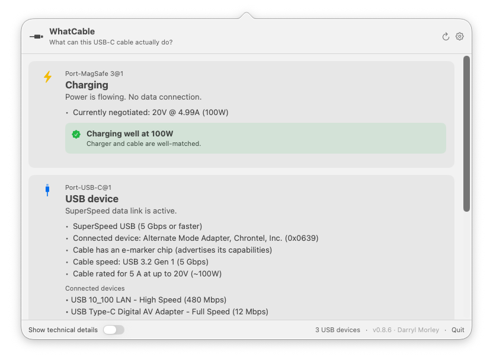

# WhatCable

> **这根 USB-C 线缆到底能做什么？**

一款小巧的 macOS 菜单栏应用，用通俗易懂的中文告诉你，插在 Mac 上的每根 USB-C 线缆实际能做什么，以及**为什么你的 Mac 充电很慢**。

USB-C 在一个接口下隐藏了很多可能性。从 USB 2.0 仅充电线缆到 240W / 40 Gbps Thunderbolt 4 线缆，在你的抽屉里看起来都一模一样。macOS 已经通过 IOKit 暴露了相关信息；WhatCable 将其呈现为友好的菜单栏弹出窗口。

[](https://github.com/darrylmorley/whatcable/releases/latest)
[](https://github.com/darrylmorley/whatcable)
[](LICENSE)



> [!IMPORTANT]
> **从 0.5.x 升级到 0.6.0？** WhatCable 的 bundle ID 在 0.6.0 中从 `com.bitmoor.whatcable` 更改为 `uk.whatcable.whatcable`，以匹配新的 `whatcable.uk` 域名。0.5.x 中的应用内"检查更新"路径将拒绝安装 0.6.0，因为下载的 bundle ID 与预期不匹配。请通过 Homebrew (`brew upgrade --cask whatcable`) 升级，或下载[最新发布 zip](https://github.com/darrylmorley/whatcable/releases/latest) 并手动替换 `WhatCable.app`。你的偏好设置和通知权限将在 0.6.0 首次启动时重置；如果之前开启了登录启动，请在设置中重新启用。这仅影响 0.5.x → 0.6.0 的过渡。

## 功能特性

每个端口，通俗易懂地显示：

- **概览标题：** 雷电 / USB4、USB 设备、仅充电、慢速 USB / 仅充电线缆、未连接任何设备
- **充电诊断：** 当插入设备时，横幅会识别瓶颈：
  - *"线缆限制了充电速度"*（线缆额定值低于充电器）
  - *"正在以 30W 充电（充电器最高支持 96W）"*（Mac 请求较低功率，例如电池接近充满）
  - *"正在以 96W 良好充电"*（一切匹配）
- **线缆 e-marker 信息：** 线缆的实际速度（USB 2.0、5 / 10 / 20 / 40 / 80 Gbps）、电流额定值（3 A / 5 A，最高 60W / 100W / 240W）以及芯片供应商
- **线缆信任信号：** 当 e-marker 报告的值看起来不符合 USB-PD 规范时，会出现橙色卡片，例如零供应商 ID、速度 / 电流 / 线缆延迟字段中的保留位模式，或不在 USB-IF 公布列表中的 VID。措辞故意含糊：标记意味着"这看起来不寻常"，而不是"这根线缆是假的。"
- **充电器 PDO 列表：** 充电器公布的每个电压配置文件（5V / 9V / 12V / 15V / 20V…），实时高亮显示当前协商的配置文件
- **连接的设备身份：** 供应商名称和产品类型，从 PD Discover Identity 响应解码
- **连接的 USB 设备：** 存储设备、集线器和外设列在它们插入的物理端口下，显示协商速度
- **活动传输协议：** USB 2 / USB 3 / 雷电 / DisplayPort
- **⌥-点击** 菜单栏图标（或在设置中翻转开关）以显示工程师所需的底层 IOKit 属性

点击弹出窗口标题栏中的**齿轮图标**打开设置，你可以：

- 隐藏空端口
- 登录时启动
- 作为常规 Dock 应用运行，而不是菜单栏图标
- 在线缆连接或断开时获取通知

右键点击菜单栏图标可访问**刷新**、**保持窗口打开**开关（方便截图和演示）、**检查更新…**、**关于**、**GitHub 上的 WhatCable** 和**退出**。

## 安装

访问 [whatcable.uk](https://whatcable.uk) 查看概述和截图，或直接通过以下方式安装。

从[发布页面](https://github.com/darrylmorley/whatcable/releases/latest)下载最新的 `WhatCable.zip`，解压缩，然后将 `WhatCable.app` 拖到 `/Applications`。

该应用是通用应用（Apple silicon + Intel），使用开发者 ID 签名，并经过 Apple 公证，因此没有 Gatekeeper 警告。

需要 macOS 14 (Sonoma) 或更高版本。仅支持 Apple Silicon。在 Intel Mac 上，USB-C 端口由 Intel Titan Ridge / JHL9580 Thunderbolt 3 控制器驱动，WhatCable 依赖的 USB-PD 状态和线缆 e-marker 数据未通过任何公共 IOKit 访问器暴露。

> **注意：** 手动安装仅提供菜单栏应用。`whatcable` CLI 捆绑在 `.app` 内，默认不在你的 PATH 中。如果你想从 shell 使用它，请参阅下面的[命令行界面](#命令行界面)部分获取单行符号链接命令。或通过 Homebrew 安装，它会自动设置 CLI。

### Homebrew

```bash
brew tap darrylmorley/whatcable
brew install --cask whatcable
```

这会安装菜单栏应用并将 `whatcable` CLI 符号链接到你的 PATH。

## 命令行界面

`whatcable` 二进制文件与菜单栏应用一起提供，由相同的诊断引擎驱动：

```bash
whatcable                # 每个端口的人类可读摘要
whatcable --json         # 结构化 JSON，可管道到 jq
whatcable --watch        # 在线缆插入和拔出时流式更新（Ctrl+C 退出）
whatcable --raw          # 包含底层 IOKit 属性
whatcable --version
whatcable --help
```

如果你是手动安装 `.app` 而不是通过 Homebrew，CLI 位于 `WhatCable.app/Contents/Helpers/whatcable`。如果你想在 shell 上使用它，请将其符号链接到你的 PATH：

```bash
ln -s /Applications/WhatCable.app/Contents/Helpers/whatcable /usr/local/bin/whatcable
```

Homebrew 安装会自动执行此操作。

## 工作原理

WhatCable 读取四类 IOKit 服务。无需授权、无需私有 API、无需辅助守护程序：

| 服务 | 提供的信息 |
| --- | --- |
| `AppleHPMInterfaceType10/11/12`（M3 时代）、`AppleTCControllerType10/11`（M1 / M2）和 `IOPort`（M4 Mac mini 前面板端口） | 每端口状态：连接、传输协议、插头方向、e-marker 存在。`Type11` 是 M2 MacBook Air 用于其 MagSafe 3 端口的。 |
| `IOPortFeaturePowerSource` | 来自连接源的完整 PDO 列表，带有实时"获胜"PDO |
| `IOPortTransportComponentCCUSBPDSOP`、`...SOPp`、`...SOPpp` | 来自端口伙伴 (SOP)、线缆近端 e-marker (SOP') 和远端 e-marker (SOP'')（如果存在）的 PD Discover Identity VDO |
| XHCI 控制器子树 | 每个连接的 USB 设备通过其物理端口配对，通过 XHCI 端口节点的 `UsbIOPort` 注册表路径，在不暴露 `UsbIOPort` 的机器上回退到从控制器的 `locationID` 高字节和端口的 `hpm` SPMI 祖先派生的总线索引。 |

线缆速度和功率解码遵循 USB Power Delivery 规范（对齐到 USB-PD R3.2 V1.2，2026 年 3 月）。供应商名称来自 USB-IF 公布的供应商 ID 列表，作为 TSV 捆绑，可通过 `scripts/update-vendor-db.sh` 刷新。

## 从源码构建

```bash
swift run WhatCable          # 菜单栏应用
swift run whatcable-cli      # CLI
```

需要 Swift 5.9（Xcode 15+）。

## 构建可分发的 .app

```bash
./scripts/build-app.sh
```

生成通用的 `dist/WhatCable.app`（arm64 + x86_64）和 `dist/WhatCable.zip`。

**模式：**

| 配置 | 结果 |
| --- | --- |
| 无 `.env` | 临时签名。本地工作；在其他 Mac 上 Gatekeeper 会警告。 |
| `.env` 带 `DEVELOPER_ID` | 开发者 ID 签名 + 强化运行时。 |
| `.env` 带 `DEVELOPER_ID` + `NOTARY_PROFILE` | 完整公证 + 装订票据。对所有人而言都是 Gatekeeper 干净的。 |

**发布版本：**

```bash
# 先编写 release-notes/v0.5.3.md，然后：
./scripts/release.sh 0.5.3
```

包装器执行整个流水线：版本升级，运行 build-app.sh（构建、签名、公证、冒烟测试并升级本地 cask）、标记并推送提交、使用说明文件创建 GitHub 发布、验证上传资源的 sha 与本地 zip 匹配、将说明复制到 tap 并推送 tap。首先使用 `--dry-run` 验证状态。需要 `gh`（已认证）和 `.env.example` 中的环境变量。

**首次完整公证设置：**

```bash
# 1. 找到你的签名身份
security find-identity -v -p codesigning

# 2. 将 notarytool 凭据存储在钥匙串中
xcrun notarytool store-credentials "WhatCable-notary" \
    --apple-id "you@example.com" \
    --team-id "ABCDE12345" \
    --password "<app-specific-password>"   # 在 appleid.apple.com 生成

# 3. 从模板创建你的 .env
cp .env.example .env
# ...并填写 DEVELOPER_ID
```

## 注意事项

- **线缆 e-marker 信息仅出现在携带 e-marker 的线缆上。** 大多数 60W 以下的 USB-C 线缆未标记。任何雷电 / USB4 线缆、任何 5A / 100W+ 线缆以及大多数优质数据线缆都会进行 e-marked。
- **有些线缆仅在其他端插入设备后才显示其 e-marker。** 线缆插头中的芯片从 VCONN（你的 Mac 馈入线缆的小型电源轨）运行，并且仅在主机发出"Discover Identity"消息时应答。在没有附件的情况下，某些 Mac 会立即读取 e-marker，而其他 Mac 则等到看到真正的伙伴进行协商。如果线缆在裸露时显示为基本线缆，请将充电器、扩展坞或设备插入远端并再次检查。
- **WhatCable 信任 e-marker 的功能。** 线缆速度、电流额定值和供应商直接来自线缆插头中的芯片，软件无法验证外套内部的内容。如果线缆声称 240W / 40 Gbps 但性能不佳，则是芯片在撒谎，而不是 WhatCable。信任信号卡片标记了一小组内部一致性信号（零 VID、Cable VDO 中的保留位模式、不在 USB-IF 列表中的 VID），这些信号经常出现在假冒或错误刷写的线缆上，但这些标记是含糊的信号，不是证据。
- **PD 规范覆盖：** 解码器对齐到 USB-PD R3.2 V1.2（2026 年 3 月）。早期的 3.0 / 3.1 线缆工作正常。
- **供应商名称查找使用 USB-IF 公布的列表**（约 13,650 个条目，2026 年 3 月快照）。在该快照之后 USB-IF 分配的 VID 将显示为"未注册 / 未知"并触发信任信号标记，直到捆绑列表被刷新。
- **仅限 macOS。** iOS 沙盒使 USB-C e-marker 访问更加困难。
- **仅限 Apple Silicon。** Intel Mac 通过 Intel Thunderbolt 3 控制器（Titan Ridge / JHL9580）路由 USB-C。Apple 针对这些芯片的 IOKit 驱动程序不暴露 USB-PD 协商状态或线缆 e-marker VDO，因此无法在 Intel 硬件上提供相同的信息。
- **不在 App Store 上。** 应用沙盒阻止了我们依赖的 IOKit 读取。

## 隐私

WhatCable 直接从 Mac 上的 IOKit 读取 USB-C 端口状态。所有操作都在本地进行。不会自动发送任何内容到任何地方。

**线缆报告：** 如果你在 e-marked 线缆上使用"报告此线缆"按钮，WhatCable 会构建一个预填充的 GitHub issue，包含线缆的供应商 ID、产品 ID 和功能标志 (VDO)。你的浏览器会打开带有该数据的 issue 表单。在你自己在 GitHub 中点击按钮之前，不会提交任何内容。提交后，issue 是公开的。

**更新检查：** WhatCable 定期检查 GitHub Releases API 以查看是否有较新版本可用。该请求不包含个人数据或硬件信息。

## 贡献

欢迎提交 issue 和 PR。代码量小，力求保持可读性。从 [`Sources/WhatCable/ContentView.swift`](Sources/WhatCable/ContentView.swift) 开始了解 UI，从 [`Sources/WhatCableCore/PortSummary.swift`](Sources/WhatCableCore/PortSummary.swift) 了解通俗易懂的逻辑，或从 [`Sources/WhatCableCore/PDVDO.swift`](Sources/WhatCableCore/PDVDO.swift) 了解位操作。跨平台模型和诊断引擎位于 `WhatCableCore`；IOKit 监视器（端口状态、PD 身份、电源、USB 设备）位于 [`Sources/WhatCableDarwinBackend/`](Sources/WhatCableDarwinBackend/)。相同的 `WhatCableCore` 为菜单栏应用和 [`Sources/WhatCableCLI/`](Sources/WhatCableCLI/) 中的 `whatcable` CLI 提供动力。

## 致谢

由 [Darryl Morley](https://github.com/darrylmorley) 构建。

灵感来自每次有人问"*这根线缆好吗？*"。
